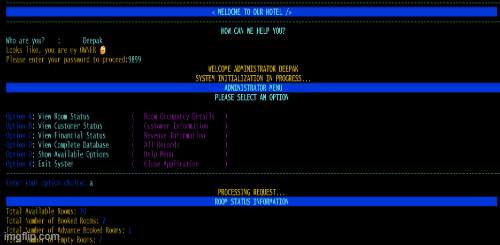

# HOTEL ROOM MANAGEMENT SYSTEM
ADMIN Name = "deepak" and password logiic is not setted, so every pass is accepted
## 1. Introduction

- This is a simple hotel room management system built using Python.
- It allows admins to manage room bookings and customer information.
- It also allows customers to book rooms, view room details, and check out.
- I created this at start of my py oops learning.

## 2. Functionality

### The Hotel Room Management System provides the following functionalities:

1. **Admin Functionalities:**
   - **View Room Status:** Admin can view the current status of all rooms, including the number of available, booked, and advance booked rooms.
   - **View Customer Status:** Admin can view detailed information about customers who have booked or reserved rooms.
   - **View Financial Status:** Admin can view the revenue information generated from room bookings.
   - **View Complete Database:** Admin can view all records in the hotel database.
   - **Show Available Options:** Admin can view the help menu with all available options.
   - **Exit System:** Admin can exit the system.

2. **Customer Functionalities:**
   - **Book a Room:** Customers can book a new room.
   - **View Room Details:** Customers can view details of their room bookings.
   - **View Room Rates:** Customers can view the current room rates for standard and advance bookings.
   - **Check Out:** Customers can cancel their room bookings.
   - **Show Available Options:** Customers can view the help menu with all available options.
   - **Exit System:** Customers can exit the system.

3. **System Initialization:**
   - The system initializes with a welcome message and prompts the user to identify themselves as either an admin or a customer.
   - Based on the user's input, the system provides the appropriate functionalities and options.

4. **Password Confirmation:**
   - Admins are required to enter their password to proceed with administrative tasks.

5. **User Interaction:**
   - The system interacts with users through a series of prompts and inputs, providing a user-friendly interface for managing hotel room bookings and customer information.

6. **Data Management:**
   - The system maintains a list of customer data, including room status, customer details, and booking information.

7. **Error Handling:**
   - The system handles invalid inputs and provides error messages to guide users to select valid options.

### Note:
- The system uses colored text and background for better readability and user experience.
- The system can be reset and restarted based on user actions, ensuring continuous operation without manual intervention.

## 3. What I learned?

- OOPs
  - I learned the way to structure mothods in classes.
  - codes are more modular and easier to maintain.
  - I learned how to use classes and objects to manage data and functionality.

- module in python
  - I learned how to create my own module and use it in the main file.
  - I learned how to import module in the main file.
  - I learned how to use function, class and variable in the other module file.
- list in python as database
  - I learned how to use list as a database to store data.
  - I learned how to access, modify, and manipulate list data.  
  - list is a collection of dictonary  which is ordered and changeable.

---
# Contact Me

[Contact via MAIL](mailto:code.deepak9899@gmail.com)
&nbsp;&nbsp;&nbsp;&nbsp;&nbsp;
[Contact via LINKEDIN](https://www.linkedin.com/in/deepak-sharma-709823331?utm_source=share&utm_campaign=share_via&utm_content=profile&utm_medium=android_app)

---

# THE END 🍵  
